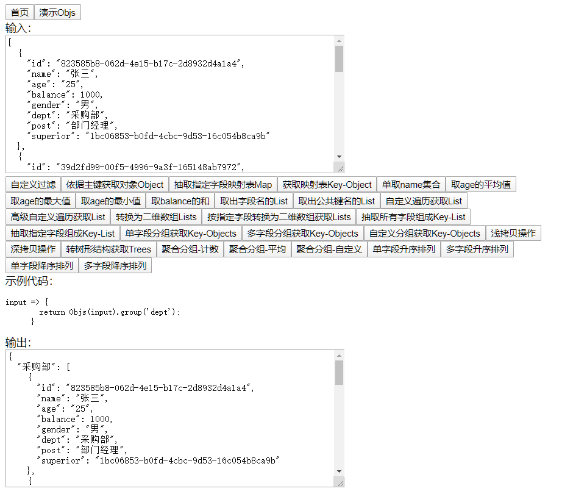

# YumeiSoft.CommonFrontUtils

## 强大的通用前端算法库

（瑜美科技出品）

> 如果你觉得这个项目帮助到你了，不妨请作者喝杯咖啡吧，作者会更加努力更新哦！
>
> 

如何启动演示：

```
yarn install
yarn start
```

目录结构：

```
src React项目
src/demo 示例
src/Yumeisoft/CommonFrontUtils 源代码
```

工具类型：

```
Objs 对象数组操作工具
Obj  对象操作工具
List 数组操作工具
```

快速开始：

```
把Yumeisoft目录放入项目的src目录中即可
```

> Objs 算法一览
> 

## Objs - 对象数组操作工具

引用

```javascript
// 请根据项目实际路径设置导入路径
import Objs from './Yumeisoft/CommonFrontUtils/Objs';
```

以以下数据为例，介绍 Objs 各个功能

```javascript
let input = [
  {
    id: '823585b8-062d-4e15-b17c-2d8932d4a1a4',
    name: '张三',
    age: '25',
    balance: 1000,
    gender: '男',
    dept: '采购部',
    post: '部门经理',
    superior: '1bc06853-b0fd-4cbc-9d53-16c054b8ca9b',
  },
  {
    id: '39d2fd99-00f5-4996-9a3f-165148ab7972',
    name: '李四',
    age: 17,
    balance: 400,
    gender: '男',
    dept: '技术部',
    post: '管理培训生',
    deptId: '2',
    superior: '37f15bff-e0ee-4b44-9291-5c9fa0bcf954',
  },
  {
    id: '37f15bff-e0ee-4b44-9291-5c9fa0bcf954',
    name: '王五',
    age: 30,
    balance: 500,
    gender: '男',
    dept: '技术部',
    post: '部门经理',
    superior: '1bc06853-b0fd-4cbc-9d53-16c054b8ca9b',
  },
  {
    id: '0f0479cc-59fe-4c56-9685-75c4067300b6',
    name: '小红',
    age: 16,
    balance: 200,
    gender: '女',
    dept: '采购部',
    post: '管理培训生',
    superior: '823585b8-062d-4e15-b17c-2d8932d4a1a4',
  },
  {
    id: 'f01430fd-5df3-402a-92ef-aca63d882e2b',
    name: '小明',
    age: 24,
    balance: 700,
    gender: '男',
    dept: '技术部',
    post: '管理培训生',
    superior: '37f15bff-e0ee-4b44-9291-5c9fa0bcf954',
  },
];
```

### 深拷贝操作

说明：默认 Objs 工具采用浅拷贝操作，因此在回调操作中允许用户对输入数据原对象进行修改，执行深拷贝操作之后，所有的操作都只针对副本操作，不影响原对象的数据。返回值为 Objs 类型，方便后续链式调用。

```javascript
Objs(输入数据).deepClone();
```

示例代码：

```javascript
详见DEMO;
```

执行结果:

```javascript
详见DEMO;
```

### 自定义过滤

说明：使用自定义过滤功能可以快速从庞大的数据集中筛选出想要的数据子集，在回调函数中被判定为 true 的数据将会被列出来。相当于 SQL 语句的"select \* from 表 where 表达式"。返回值是 List-Objects 类型。

```javascript
Objs(输入数据).filter(返回值为布尔类型的回调函数).list();
```

示例代码：

```javascript
// 从员工数据中获取年龄大于18岁的数据子集
Objs(input)
  .filter((item) => item.age > 18)
  .list();
```

执行结果:

```javascript
[
  {
    id: '823585b8-062d-4e15-b17c-2d8932d4a1a4',
    name: '张三',
    age: '25',
    balance: 1000,
    gender: '男',
    dept: '采购部',
    post: '部门经理',
    superior: '1bc06853-b0fd-4cbc-9d53-16c054b8ca9b',
  },
  {
    id: '37f15bff-e0ee-4b44-9291-5c9fa0bcf954',
    name: '王五',
    age: 30,
    balance: 500,
    gender: '男',
    dept: '技术部',
    post: '部门经理',
    superior: '1bc06853-b0fd-4cbc-9d53-16c054b8ca9b',
  },
  {
    id: 'f01430fd-5df3-402a-92ef-aca63d882e2b',
    name: '小明',
    age: 24,
    balance: 700,
    gender: '男',
    dept: '技术部',
    post: '管理培训生',
    superior: '37f15bff-e0ee-4b44-9291-5c9fa0bcf954',
  },
];
```

### 依据主键获取对象 Object

说明：依据主键（或唯一字段）来获取唯一对象。相当于 SQL 语句的"select \* from 表 where 主键字段 = 主键值"。返回值为 Object 类型。

```javascript
Objs(输入数据).one(主键或唯一字段, 字段值);
```

示例代码：

```javascript
// 从员工数据中获取ID等于0f0479cc-59fe-4c56-9685-75c4067300b6的记录
Objs(input).one('id', '0f0479cc-59fe-4c56-9685-75c4067300b6');
```

执行结果:

```javascript
{
  "id": "0f0479cc-59fe-4c56-9685-75c4067300b6",
  "name": "小红",
  "age": 16,
  "balance": 200,
  "gender": "女",
  "dept": "采购部",
  "post": "管理培训生",
  "superior": "823585b8-062d-4e15-b17c-2d8932d4a1a4"
}
```

### 抽取指定字段映射表 Map

说明：将主键或唯一字段与另一个字段组成哈希表，可用于开发列表、外键翻译功能。相当于 SQL 语句的"select 主键字段,显示名称 from 表"。返回值为 Object 类型。

```javascript
Objs(输入数据).keyColumn(主键或唯一字段, 映射字段);
```

示例代码：

```javascript
// 从员工数据中获取ID和NAME字段的对照表
Objs(input).keyColumn('id', 'name');
```

执行结果:

```javascript
{
  "823585b8-062d-4e15-b17c-2d8932d4a1a4": "张三",
  "39d2fd99-00f5-4996-9a3f-165148ab7972": "李四",
  "37f15bff-e0ee-4b44-9291-5c9fa0bcf954": "王五",
  "0f0479cc-59fe-4c56-9685-75c4067300b6": "小红",
  "f01430fd-5df3-402a-92ef-aca63d882e2b": "小明"
}
```

### 获取映射表 Key-Object

说明：将主键或唯一字段设置为键，常用于缓存、免遍历等需要提高执行和开发效率的地方。返回值为 Object 类型。

```javascript
Objs(输入数据).keyObj(主键或唯一字段);
```

示例代码：

```javascript
// 从员工数据中获取ID和值对象的对照表
Objs(input).keyObj('id');
```

执行结果:

```javascript
{
  "823585b8-062d-4e15-b17c-2d8932d4a1a4": {
    "id": "823585b8-062d-4e15-b17c-2d8932d4a1a4",
    "name": "张三",
    "age": "25",
    "balance": 1000,
    "gender": "男",
    "dept": "采购部",
    "post": "部门经理",
    "superior": "1bc06853-b0fd-4cbc-9d53-16c054b8ca9b"
  },
  "39d2fd99-00f5-4996-9a3f-165148ab7972": {
    "id": "39d2fd99-00f5-4996-9a3f-165148ab7972",
    "name": "李四",
    "age": 17,
    "balance": 400,
    "gender": "男",
    "dept": "技术部",
    "post": "管理培训生",
    "deptId": "2",
    "superior": "37f15bff-e0ee-4b44-9291-5c9fa0bcf954"
  },
  "37f15bff-e0ee-4b44-9291-5c9fa0bcf954": {
    "id": "37f15bff-e0ee-4b44-9291-5c9fa0bcf954",
    "name": "王五",
    "age": 30,
    "balance": 500,
    "gender": "男",
    "dept": "技术部",
    "post": "部门经理",
    "superior": "1bc06853-b0fd-4cbc-9d53-16c054b8ca9b"
  },
  "0f0479cc-59fe-4c56-9685-75c4067300b6": {
    "id": "0f0479cc-59fe-4c56-9685-75c4067300b6",
    "name": "小红",
    "age": 16,
    "balance": 200,
    "gender": "女",
    "dept": "采购部",
    "post": "管理培训生",
    "superior": "823585b8-062d-4e15-b17c-2d8932d4a1a4"
  },
  "f01430fd-5df3-402a-92ef-aca63d882e2b": {
    "id": "f01430fd-5df3-402a-92ef-aca63d882e2b",
    "name": "小明",
    "age": 24,
    "balance": 700,
    "gender": "男",
    "dept": "技术部",
    "post": "管理培训生",
    "superior": "37f15bff-e0ee-4b44-9291-5c9fa0bcf954"
  }
}
```

### 维度抽取

说明：抽取单一维度组成一维数组。相当于 SQL 语句"Select 字段 from 表"。返回值为 Array 类型。

```javascript
Objs(输入数据).colList(字段名);
```

示例代码：

```javascript
// 从员工数据中获取所有姓名
Objs(input).colList('name');
```

执行结果:

```javascript
['张三', '李四', '王五', '小红', '小明'];
```

### 快速平均值

说明：快速计算一组数据中的平均值，在计算过程中会自动筛掉不是数字的字段值，string 类型的数字会被自动转换参与计算。相当于 SQL 语句"Select avg(字段) from 表"。返回值为 Number 类型。

```javascript
Objs(输入数据).colAvg(字段名);
```

示例代码：

```javascript
// 从员工数据中计算平均年龄
Objs(input).colAvg('age');
```

执行结果:

```javascript
22.4;
```

### 快速最大值

说明：快速计算一组数据中的最大值，在计算过程中会自动筛掉不是数字的字段值，string 类型的数字会被自动转换参与计算。相当于 SQL 语句"Select max(字段) from 表"。返回值为 Number 类型。

```javascript
Objs(输入数据).colMax(字段名);
```

示例代码：

```javascript
// 从员工数据中获取最大年龄
Objs(input).colMax('age');
```

执行结果:

```javascript
30;
```

### 快速最小值

说明：快速计算一组数据中的最小值，在计算过程中会自动筛掉不是数字的字段值，string 类型的数字会被自动转换参与计算。相当于 SQL 语句"Select min(字段) from 表"。返回值为 Number 类型。

```javascript
Objs(输入数据).colMin(字段名);
```

示例代码：

```javascript
// 从员工数据中获取最小年龄
Objs(input).colMin('age');
```

执行结果:

```javascript
16;
```

### 快速求和

说明：快速计算一组数据中所有数值的和，在计算过程中会自动筛掉不是数字的字段值，string 类型的数字会被自动转换参与计算。相当于 SQL 语句"Select sum(字段) from 表"。返回值为 Number 类型。

```javascript
Objs(输入数据).colSum(字段名);
```

示例代码：

```javascript
// 从员工数据中获取报销额度余额的总和
Objs(input).colSum('balance');
```

执行结果:

```javascript
2800;
```

### 取出字段名的 List

说明：以贪婪模式（如果某个对象包含其他对象不包含的键，也被视为有效）获取所有字段。返回值为 Array 类型。

```javascript
Objs(输入数据).colNames();
```

示例代码：

```javascript
// 在员工数据中获取所有字段
Objs(input).colNames();
```

执行结果:

```javascript
['id', 'name', 'age', 'balance', 'gender', 'dept', 'post', 'superior', 'deptId'];
```

### 取出公共字段名的 List

说明：以谨慎模式（如果某个对象包含其他对象不包含的键，该键会被忽略）获取所有字段。返回值为 Array 类型。

```javascript
Objs(输入数据).sharedColNames();
```

示例代码：

```javascript
// 在员工数据中获取所有公共字段
Objs(input).sharedColNames();
```

执行结果:

```javascript
['id', 'name', 'age', 'balance', 'gender', 'dept', 'post', 'superior'];
```

### 自定义遍历并获取 List

说明：对每个数据对象都进行遍历，默认因为是浅拷贝，因此会对原有数据形成事实影响。返回值为 Array 类型，即新生成的数组（需要使用下文回调函数的形态 2）。

```javascript
Objs(输入数据).each(返回值为Object类型的回调函数);
```

回调函数定义

```javascript
// 形态1
(每次遍历的数据,数组下标)=>(无返回值的表达式)
// 形态2
(每次遍历的数据,数组下标)=>{
    函数体
    return 新数据
}
```

示例代码：

```javascript
// 在员工数据批量设置状态为0（正常）
Objs(input).each((item) => (item.status = 0));
```

执行结果:

```javascript
[
  {
    id: '823585b8-062d-4e15-b17c-2d8932d4a1a4',
    name: '张三',
    age: '25',
    balance: 1000,
    gender: '男',
    dept: '采购部',
    post: '部门经理',
    superior: '1bc06853-b0fd-4cbc-9d53-16c054b8ca9b',
    status: 0,
  },
  {
    id: '39d2fd99-00f5-4996-9a3f-165148ab7972',
    name: '李四',
    age: 17,
    balance: 400,
    gender: '男',
    dept: '技术部',
    post: '管理培训生',
    deptId: '2',
    superior: '37f15bff-e0ee-4b44-9291-5c9fa0bcf954',
    status: 0,
  },
  {
    id: '37f15bff-e0ee-4b44-9291-5c9fa0bcf954',
    name: '王五',
    age: 30,
    balance: 500,
    gender: '男',
    dept: '技术部',
    post: '部门经理',
    superior: '1bc06853-b0fd-4cbc-9d53-16c054b8ca9b',
    status: 0,
  },
  {
    id: '0f0479cc-59fe-4c56-9685-75c4067300b6',
    name: '小红',
    age: 16,
    balance: 200,
    gender: '女',
    dept: '采购部',
    post: '管理培训生',
    superior: '823585b8-062d-4e15-b17c-2d8932d4a1a4',
    status: 0,
  },
  {
    id: 'f01430fd-5df3-402a-92ef-aca63d882e2b',
    name: '小明',
    age: 24,
    balance: 700,
    gender: '男',
    dept: '技术部',
    post: '管理培训生',
    superior: '37f15bff-e0ee-4b44-9291-5c9fa0bcf954',
    status: 0,
  },
];
```

### 转换为二维数组 Lists

说明：按照 colNames()排列的字段顺序，将数据转换为二维数组，某些前后端交互的时候要用这种格式。返回值为 Array 类型。

```javascript
Objs(输入数据).toLists();
```

示例代码：

```javascript
// 将员工数据转换为二维数组
Objs(input).toLists();
```

执行结果:

```javascript
[
  [
    '823585b8-062d-4e15-b17c-2d8932d4a1a4',
    '张三',
    '25',
    1000,
    '男',
    '采购部',
    '部门经理',
    '1bc06853-b0fd-4cbc-9d53-16c054b8ca9b',
    null,
  ],
  [
    '39d2fd99-00f5-4996-9a3f-165148ab7972',
    '李四',
    17,
    400,
    '男',
    '技术部',
    '管理培训生',
    '37f15bff-e0ee-4b44-9291-5c9fa0bcf954',
    '2',
  ],
  [
    '37f15bff-e0ee-4b44-9291-5c9fa0bcf954',
    '王五',
    30,
    500,
    '男',
    '技术部',
    '部门经理',
    '1bc06853-b0fd-4cbc-9d53-16c054b8ca9b',
    null,
  ],
  [
    '0f0479cc-59fe-4c56-9685-75c4067300b6',
    '小红',
    16,
    200,
    '女',
    '采购部',
    '管理培训生',
    '823585b8-062d-4e15-b17c-2d8932d4a1a4',
    null,
  ],
  [
    'f01430fd-5df3-402a-92ef-aca63d882e2b',
    '小明',
    24,
    700,
    '男',
    '技术部',
    '管理培训生',
    '37f15bff-e0ee-4b44-9291-5c9fa0bcf954',
    null,
  ],
];
```

### 按指定字段转换为二维数组获取 Lists

说明：按照给定的字段顺序，将数据转换为二维数组，某些前后端交互的时候要用这种格式。返回值为 Array 类型。

```javascript
Objs(输入数据).toLists(字段数组);
```

示例代码：

```javascript
// 将员工数据按name和age字段转换为二维数组
Objs(input).toLists(['name', 'age']);
```

执行结果:

```javascript
[
  ['张三', '25'],
  ['李四', 17],
  ['王五', 30],
  ['小红', 16],
  ['小明', 24],
];
```

### 抽取所有字段组成 Key-List

说明：按照 colNames()排列的字段顺序，将数据转换为字段名和一维数组的有序对照表，某些前端框架需要用到，比如 ECharts。返回值为 Object 类型。

```javascript
Objs(输入数据).colLists();
```

示例代码：

```javascript
// 将员工数据转换为字段名和一维数组对照表
Objs(input).colLists();
```

执行结果:

```javascript
{
  "id": [
    "823585b8-062d-4e15-b17c-2d8932d4a1a4",
    "39d2fd99-00f5-4996-9a3f-165148ab7972",
    "37f15bff-e0ee-4b44-9291-5c9fa0bcf954",
    "0f0479cc-59fe-4c56-9685-75c4067300b6",
    "f01430fd-5df3-402a-92ef-aca63d882e2b"
  ],
  "name": [
    "张三",
    "李四",
    "王五",
    "小红",
    "小明"
  ],
  "age": [
    "25",
    17,
    30,
    16,
    24
  ],
  "balance": [
    1000,
    400,
    500,
    200,
    700
  ],
  "gender": [
    "男",
    "男",
    "男",
    "女",
    "男"
  ],
  "dept": [
    "采购部",
    "技术部",
    "技术部",
    "采购部",
    "技术部"
  ],
  "post": [
    "部门经理",
    "管理培训生",
    "部门经理",
    "管理培训生",
    "管理培训生"
  ],
  "superior": [
    "1bc06853-b0fd-4cbc-9d53-16c054b8ca9b",
    "37f15bff-e0ee-4b44-9291-5c9fa0bcf954",
    "1bc06853-b0fd-4cbc-9d53-16c054b8ca9b",
    "823585b8-062d-4e15-b17c-2d8932d4a1a4",
    "37f15bff-e0ee-4b44-9291-5c9fa0bcf954"
  ],
  "deptId": [
    null,
    "2",
    null,
    null,
    null
  ]
}
```

### 抽取指定字段组成 Key-List

说明：按照指定的字段顺序排列，将数据转换为字段名和一维数组的有序对照表，某些前端框架需要用到，比如 ECharts。返回值为 Object 类型。

```javascript
Objs(输入数据).colLists(字段列表);
```

示例代码：

```javascript
// 将员工数据转换为字段名和一维数组对照表，其中包含姓名和性别
Objs(input).colLists(['name', 'gender']);
```

执行结果:

```javascript
{
  "name": [
    "张三",
    "李四",
    "王五",
    "小红",
    "小明"
  ],
  "gender": [
    "男",
    "男",
    "男",
    "女",
    "男"
  ]
}
```

### 单字段分组获取 Key-Objects

说明：按照指定的字段进行分组，将数据转换为分组依据和对象数组的有序对照表。返回值为 Object 类型。

```javascript
Objs(输入数据).group(分组字段);
```

示例代码：

```javascript
// 根据员工数据按部门分组
Objs(input).group('dept');
```

执行结果:

```javascript
{
  "采购部": [
    {
      "id": "823585b8-062d-4e15-b17c-2d8932d4a1a4",
      "name": "张三",
      "age": "25",
      "balance": 1000,
      "gender": "男",
      "dept": "采购部",
      "post": "部门经理",
      "superior": "1bc06853-b0fd-4cbc-9d53-16c054b8ca9b"
    },
    {
      "id": "0f0479cc-59fe-4c56-9685-75c4067300b6",
      "name": "小红",
      "age": 16,
      "balance": 200,
      "gender": "女",
      "dept": "采购部",
      "post": "管理培训生",
      "superior": "823585b8-062d-4e15-b17c-2d8932d4a1a4"
    }
  ],
  "技术部": [
    {
      "id": "39d2fd99-00f5-4996-9a3f-165148ab7972",
      "name": "李四",
      "age": 17,
      "balance": 400,
      "gender": "男",
      "dept": "技术部",
      "post": "管理培训生",
      "deptId": "2",
      "superior": "37f15bff-e0ee-4b44-9291-5c9fa0bcf954"
    },
    {
      "id": "37f15bff-e0ee-4b44-9291-5c9fa0bcf954",
      "name": "王五",
      "age": 30,
      "balance": 500,
      "gender": "男",
      "dept": "技术部",
      "post": "部门经理",
      "superior": "1bc06853-b0fd-4cbc-9d53-16c054b8ca9b"
    },
    {
      "id": "f01430fd-5df3-402a-92ef-aca63d882e2b",
      "name": "小明",
      "age": 24,
      "balance": 700,
      "gender": "男",
      "dept": "技术部",
      "post": "管理培训生",
      "superior": "37f15bff-e0ee-4b44-9291-5c9fa0bcf954"
    }
  ]
}
```

### 多字段分组获取 Key-Objects

说明：按照指定的多个字段进行分组，将数据转换为分组依据和对象数组的有序对照表。其中分组依据是数组的 JSON 字符串格式，返回值为 Object 类型。

```javascript
Objs(输入数据).group(字段列表);
```

示例代码：

```javascript
// 根据员工数据按部门和性别分组
Objs(input).group(['dept', 'gender']);
```

执行结果:

```javascript
{
  "[\"采购部\",\"男\"]": [
    {
      "id": "823585b8-062d-4e15-b17c-2d8932d4a1a4",
      "name": "张三",
      "age": "25",
      "balance": 1000,
      "gender": "男",
      "dept": "采购部",
      "post": "部门经理",
      "superior": "1bc06853-b0fd-4cbc-9d53-16c054b8ca9b"
    }
  ],
  "[\"技术部\",\"男\"]": [
    {
      "id": "39d2fd99-00f5-4996-9a3f-165148ab7972",
      "name": "李四",
      "age": 17,
      "balance": 400,
      "gender": "男",
      "dept": "技术部",
      "post": "管理培训生",
      "deptId": "2",
      "superior": "37f15bff-e0ee-4b44-9291-5c9fa0bcf954"
    },
    {
      "id": "37f15bff-e0ee-4b44-9291-5c9fa0bcf954",
      "name": "王五",
      "age": 30,
      "balance": 500,
      "gender": "男",
      "dept": "技术部",
      "post": "部门经理",
      "superior": "1bc06853-b0fd-4cbc-9d53-16c054b8ca9b"
    },
    {
      "id": "f01430fd-5df3-402a-92ef-aca63d882e2b",
      "name": "小明",
      "age": 24,
      "balance": 700,
      "gender": "男",
      "dept": "技术部",
      "post": "管理培训生",
      "superior": "37f15bff-e0ee-4b44-9291-5c9fa0bcf954"
    }
  ],
  "[\"采购部\",\"女\"]": [
    {
      "id": "0f0479cc-59fe-4c56-9685-75c4067300b6",
      "name": "小红",
      "age": 16,
      "balance": 200,
      "gender": "女",
      "dept": "采购部",
      "post": "管理培训生",
      "superior": "823585b8-062d-4e15-b17c-2d8932d4a1a4"
    }
  ]
}
```

### 自定义分组获取 Key-Objects

说明：灵活强大的分组方案，可以允许用户对每一个遍历的数据产生定制化的分组依据。返回值为 Object 类型。

```javascript
Objs(输入数据).group(返回值为string类型的回调函数);
```

示例代码：

```javascript
// 根据员工数据按年龄30岁及以上或30岁以下分组
Objs(input).group((item) => {
  if (item.age >= 30) {
    return '30岁及以上';
  } else {
    return '30岁以下';
  }
});
```

执行结果:

```javascript
{
  "30岁以下": [
    {
      "id": "823585b8-062d-4e15-b17c-2d8932d4a1a4",
      "name": "张三",
      "age": "25",
      "balance": 1000,
      "gender": "男",
      "dept": "采购部",
      "post": "部门经理",
      "superior": "1bc06853-b0fd-4cbc-9d53-16c054b8ca9b"
    },
    {
      "id": "39d2fd99-00f5-4996-9a3f-165148ab7972",
      "name": "李四",
      "age": 17,
      "balance": 400,
      "gender": "男",
      "dept": "技术部",
      "post": "管理培训生",
      "deptId": "2",
      "superior": "37f15bff-e0ee-4b44-9291-5c9fa0bcf954"
    },
    {
      "id": "0f0479cc-59fe-4c56-9685-75c4067300b6",
      "name": "小红",
      "age": 16,
      "balance": 200,
      "gender": "女",
      "dept": "采购部",
      "post": "管理培训生",
      "superior": "823585b8-062d-4e15-b17c-2d8932d4a1a4"
    },
    {
      "id": "f01430fd-5df3-402a-92ef-aca63d882e2b",
      "name": "小明",
      "age": 24,
      "balance": 700,
      "gender": "男",
      "dept": "技术部",
      "post": "管理培训生",
      "superior": "37f15bff-e0ee-4b44-9291-5c9fa0bcf954"
    }
  ],
  "30岁及以上": [
    {
      "id": "37f15bff-e0ee-4b44-9291-5c9fa0bcf954",
      "name": "王五",
      "age": 30,
      "balance": 500,
      "gender": "男",
      "dept": "技术部",
      "post": "部门经理",
      "superior": "1bc06853-b0fd-4cbc-9d53-16c054b8ca9b"
    }
  ]
}
```

### 转树形结构获取 Trees

说明：快速将线性结构转为树形结构，某些前端框架需要使用 JSON 树的方式进行数据渲染。返回值为 Array 类型。

```javascript
Objs(输入数据).toTrees(主键字段名, 上级主键字段名, 子树名称);
```

示例代码：

```javascript
// 将员工数据根据主键、直接上级主键变换为树形结构，每个对象携带一个下属字段，该字段中列出的所有数据都是该员工的下级员工
Objs(input).toTrees('id', 'superior', 'subordinates');
```

执行结果:

```javascript
[
  {
    id: '823585b8-062d-4e15-b17c-2d8932d4a1a4',
    name: '张三',
    age: '25',
    balance: 1000,
    gender: '男',
    dept: '采购部',
    post: '部门经理',
    superior: '1bc06853-b0fd-4cbc-9d53-16c054b8ca9b',
    subordinates: [
      {
        id: '0f0479cc-59fe-4c56-9685-75c4067300b6',
        name: '小红',
        age: 16,
        balance: 200,
        gender: '女',
        dept: '采购部',
        post: '管理培训生',
        superior: '823585b8-062d-4e15-b17c-2d8932d4a1a4',
      },
    ],
  },
  {
    id: '37f15bff-e0ee-4b44-9291-5c9fa0bcf954',
    name: '王五',
    age: 30,
    balance: 500,
    gender: '男',
    dept: '技术部',
    post: '部门经理',
    superior: '1bc06853-b0fd-4cbc-9d53-16c054b8ca9b',
    subordinates: [
      {
        id: '39d2fd99-00f5-4996-9a3f-165148ab7972',
        name: '李四',
        age: 17,
        balance: 400,
        gender: '男',
        dept: '技术部',
        post: '管理培训生',
        deptId: '2',
        superior: '37f15bff-e0ee-4b44-9291-5c9fa0bcf954',
      },
      {
        id: 'f01430fd-5df3-402a-92ef-aca63d882e2b',
        name: '小明',
        age: 24,
        balance: 700,
        gender: '男',
        dept: '技术部',
        post: '管理培训生',
        superior: '37f15bff-e0ee-4b44-9291-5c9fa0bcf954',
      },
    ],
  },
];
```

### 聚合分组

说明：快速对数据进行聚合分组运算，常用于统计。返回值为 Object 类型。

```javascript
// 分组依据可以是回调函数，详见分组相关的说明
// 聚合字段是用于抽出统计的字段
// 聚合方式可以是字符串类型的'max'、'min'、'avg'、'sum'、'count'，
// 聚合方式也可以是回调函数，用于自定义聚合方式，回调函数的定义如下:
// (聚合字段列表)=>{return 字符串类型的聚合结果};
Objs(输入数据).aggGroup(分组依据, 聚合字段, 聚合方式);
```

示例代码：

```javascript
// 根据员工数据统计出各部门的人员数量
Objs(input).aggGroup('dept', 'id', 'count');
```

执行结果:

```javascript
{
  "采购部": 2,
  "技术部": 3
}
```
### 按字段升降序排列

说明：对数据进行排序。返回值为 Object 类型。

```javascript
// 单字段升序排列
Objs(输入数据).sortBy(字段);
// 多字段升序排列
Objs(输入数据).sortBy([字段1,字段2...]);
// 单字段降序排列
Objs(输入数据).sortDescBy(字段)
// 多字段降序排列
Objs(输入数据).sortDescBy([字段1,字段2...]);
```

示例代码：

```javascript
// 将员工数据按年龄升序排列
Objs(input).sortBy('age');
```

执行结果:

```javascript
[
  {
    "id": "0f0479cc-59fe-4c56-9685-75c4067300b6",
    "name": "小红",
    "age": 16,
    "balance": 200,
    "gender": "女",
    "dept": "采购部",
    "post": "管理培训生",
    "superior": "823585b8-062d-4e15-b17c-2d8932d4a1a4"
  },
  {
    "id": "39d2fd99-00f5-4996-9a3f-165148ab7972",
    "name": "李四",
    "age": 17,
    "balance": 400,
    "gender": "男",
    "dept": "技术部",
    "post": "管理培训生",
    "deptId": "2",
    "superior": "37f15bff-e0ee-4b44-9291-5c9fa0bcf954"
  },
  {
    "id": "f01430fd-5df3-402a-92ef-aca63d882e2b",
    "name": "小明",
    "age": 24,
    "balance": 700,
    "gender": "男",
    "dept": "技术部",
    "post": "管理培训生",
    "superior": "37f15bff-e0ee-4b44-9291-5c9fa0bcf954"
  },
  {
    "id": "823585b8-062d-4e15-b17c-2d8932d4a1a4",
    "name": "张三",
    "age": "25",
    "balance": 1000,
    "gender": "男",
    "dept": "采购部",
    "post": "部门经理",
    "superior": "1bc06853-b0fd-4cbc-9d53-16c054b8ca9b"
  },
  {
    "id": "37f15bff-e0ee-4b44-9291-5c9fa0bcf954",
    "name": "王五",
    "age": 30,
    "balance": 500,
    "gender": "男",
    "dept": "技术部",
    "post": "部门经理",
    "superior": "1bc06853-b0fd-4cbc-9d53-16c054b8ca9b"
  }
]
```